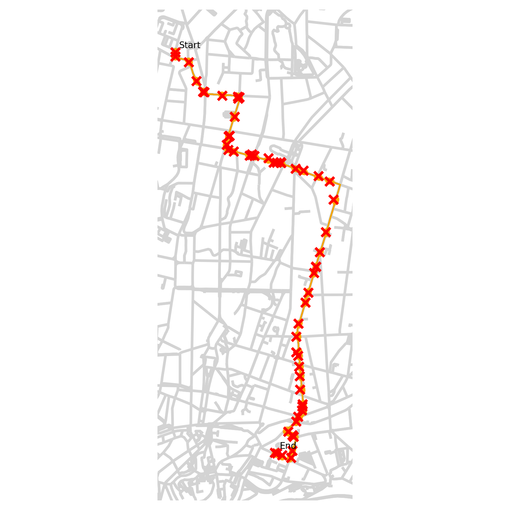

# Summary

`bmm` is a Python package providing probabilistic map-matching with uncertainty quantification.
Map-matching is the task of converting a polyline (series of noisy location observations - e.g. GPS data)
and a graph (collection of edges and nodes) into a continuous route trajectory restricted to the graph. Here a
continuous route is represented by series of connected edges as well as positions along said edges at
observation time. `bmm` uses Bayesian particle smoothing methods to produce a collection of particles, each of which
representing a continuous, plausible route along edges in the graph.

`bmm` is built on top of `OSMnx` [@Boeing2017] - a python package assisting with the retrieval and processing
of OpenStreetMap data [@OpenStreetMap]. Although, `bmm` is applicable to be used on any suitably
labelled NetworkX graph [@Hagberg2008].

In addition, `bmm` utilises `numpy` [@Harris2020] and `numba` [@Lam2015] for fast scientific calculations,
`pandas` [@Reback2020] and `geopandas` [@Jordahl2020] for spatial data storage and manipulation
as well as `matplotlib` [@Hunter2007] for visualisation.

Documentation for `bmm` can be found at [bmm.readthedocs.io](https://bmm.readthedocs.io/en/latest/).


# Statement of need

Map-matching is a vital task for data driven inference involving GPS data.
Map-matching is often non-trivial, i.e. when the graph is dense, the observation noise is significant
and/or the time between observations is large. In these cases there may be multiple routes
that could have feasibly generated the observed polyline and returning a single trajectory is suboptimal.
Indeed, of 500 routes successfully map-matched using `bmm` from the Porto taxi dataset [@taxidata], 467 exhibited
multi-modality. This uncertainty over the inferred route would not be captured in the single trajectory
approach that is adopted by the most prominent map-matching software @Luxen2011 and @Yang2018, which adapt a Viterbi
algorithm - first applied to map-matching in @Newson2009.

`bmm` adopts a state-space model approach as described in @Duffield2020
and produces a particle approximation that duly represents probabilistic
uncertainty in both the route taken and the positions at observation times. Additionally, `bmm` offers
support for both offline and online computation.


# Core Functionality

`bmm` can be used to convert a polyline (ordered series of GPS coordinates) into a collection of possible routes
along edges within a graph.

We assume that the graph is stored as a NetworkX [@Hagberg2008] object (which can easily be
achieved for a given region using `OSMnx` [@Boeing2017]) and that the polyline is stored as an array or list of
two-dimensional coordinates in the same coordinate system as the graph. A common choice for coordinate system
is UTM (Universal Transverse Mercator) which as a square coordinate system (with unit metres) is less
cumbersome than the spherical longitude-latitude coordinates system (with unit degrees). `bmm` can convert
longitude-latitude to UTM using the `bmm.long_lat_to_utm` function.

### Offline Map-matching

Given a suitable graph and polyline `bmm` can be easily used to map-match
```python
matched_particles = bmm.offline_map_match(graph, polyline=polyline_utm,
                                          n_samps=100, timestamps=15)
```
Here the `n_samps` parameter represents the number of particles/trajectories to output and `timestamps` is the
number of seconds between polyline observations - this can be a float if all observation times are equally spaced,
an array of length one less than that of the polyline representing the unequal times between observations or an 
array of length equal to the polyline representing UNIX timestamps for the observation times.

The output of `bmm.offline_map_match` is a `bmm.MMParticles` object that contains a `particles` attributes listing
the possible trajectories the algorithm has managed to fit to the polyline - full details can be found at
[bmm.readthedocs.io](https://bmm.readthedocs.io/en/latest/).

### Online Map-matching

`bmm` can also map-match data that arrives in an online or sequential manner. Initiate a `bmm.MMParticles`
with the first observation
```python
matched_particles = bmm.initiate_particles(graph,
                                           first_observation=polyline_utm[0],
                                           n_samps=100)
```
and then update as new data comes in
```python
matched_particles = bmm.update_particles(graph,
                                         matched_particles,
                                         new_observation=polyline_utm[1],
                                         time_interval=15)
```

### Parameter Tuning

The statistical model described in @Duffield2020 has various parameters which can be adjusted to fit the features
of the graph and time interval setup. This can be done by adjusting a `bmm.MapMatchingModel` argument or its
default `bmm.ExponetialMapMatchingModel` which is taken as an optional `mm_model` argument in the above
map-matching functions. In addition, these parameters can be learnt from a series of polylines using `bmm.offline_em`. 


### Plotting

Once a polyline has been succesfully map-matched, it can be visualised using `bmm`
```python
bmm.plot(graph, particles=matched_particles, polyline=polyline_utm)
```



# Acknowledgements

Samuel Duffield acknowledges support from the EPSRC.


# References